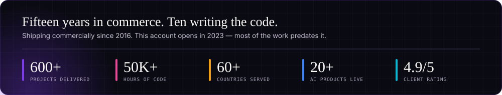
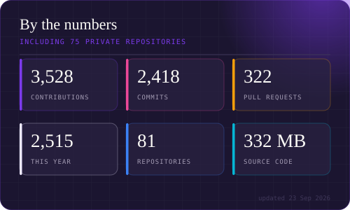
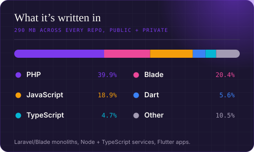

<div align="center">



<a href="https://scaleus.in"></a>
<a href="https://www.linkedin.com/in/jasminder-singh-chhabra/"></a>
<a href="https://scaleus.in/products"></a>
<a href="https://scaleus.in/portfolio"></a>


</div>

---

I run **[Scale Us Technologies LLP](https://scaleus.in)** out of India — and I'm the one shipping. Nine products in the suite, every one of them live and paying its own way: AI voice agents that answer phones, a WhatsApp Business platform on our own Meta Business Manager, social publishing across nine networks, restaurant ordering, virtual tours, LMS, analytics, invoicing and email marketing.

Fifteen years in, I still write the code. These days I write it **with AI in the loop** — spec, generate, review, ship — which is how one founder keeps nine products moving at once.

Most of what I build is **private and commercial**, so the numbers below are the honest measure of the work, not the repo list.

```
Laravel + Blade monoliths  ·  Node/TypeScript services  ·  Flutter apps
Design system → nine products  ·  Git → production on every push
```



---

## 📊 The numbers

<div align="center">


</div>

> These two cards are **generated from the GitHub API by [a workflow in this repo](.github/workflows/refresh-cards.yml)**, not by a third-party widget service.
> That's deliberate: the popular `github-readme-stats` and `github-profile-trophy` instances were returning `503`/`402` when this profile was built, and neither can read private repositories — which is where 100% of this work lives.

<div align="center">


<picture>
  <source media="(prefers-color-scheme: dark)" srcset="https://raw.githubusercontent.com/Jasminder-Chhabra/Jasminder-Chhabra/output/snake-dark.svg">
  <source media="(prefers-color-scheme: light)" srcset="https://raw.githubusercontent.com/Jasminder-Chhabra/Jasminder-Chhabra/output/snake-light.svg">
  
</picture>

</div>

---

## 🚀 The Scale Us suite

Nine products, all live in production right now.

| Product | What it does | Live |
|---|---|---|
| **Scale AI Calling** | Human-sounding AI voice agents that call leads, qualify them, book appointments and answer the phone 24/7 | [aicall.scaleus.in](https://aicall.scaleus.in) |
| **Scale WhatsApp** | Full WhatsApp Business platform — team inbox, broadcasts, visual flows, AI chatbots, catalogue | [whatsapp.scaleus.in](https://whatsapp.scaleus.in) |
| **Scale Social** | Compose once, publish to nine networks. Visual calendar, AI content studio, unified inbox | [post.scaleus.in](https://post.scaleus.in) |
| **ScaleMail** | Newsletter + lifecycle automation — drag-and-drop builder, segmentation, A/B testing | [emails.scaleus.in](https://emails.scaleus.in) |
| **Scale Dining** | Restaurant platform — QR menus, contactless ordering, kitchen display, reservations | [scaledining.com](https://scaledining.com) |
| **ScaleTour** | Virtual tours — 360° panoramas, VR walkthroughs, interactive floor plans | [tour.scaleus.in](https://tour.scaleus.in) |
| **Scale LMS** | Learning platform with tutor marketplace, live sessions and self-paced courses | [lms.scaleus.in](https://lms.scaleus.in) |
| **Scale Analytics** | Privacy-first web + product analytics — real-time dashboards, heatmaps, session replay | [analytics.scaleus.in](https://analytics.scaleus.in) |
| **Scale Invoice** | Invoicing for freelancers and teams, with GST support and recurring billing | [invoice.scaleus.in](https://invoice.scaleus.in) |

<div align="center">
<a href="https://scaleus.in/products"></a>
</div>

---

## 📱 Shipped to the stores

Nine apps through review and out to real users — [all under **Scale Us** on Google Play](https://play.google.com/store/apps/developer?id=Scale+Us).

**On-demand mobility** — the Uber/Ola pattern, both sides of the marketplace

| App | | |
|---|---|---|
| **Quick Driver** — customer app, live tracking & trip management | iOS · Android | [App Store](https://apps.apple.com/in/app/quick-driver-in/id6758759788) · [Google Play](https://play.google.com/store/apps/details?id=com.quickdriver.scaleuscustomer) |
| **Quick Rider** — the driver-side app | Android | [Google Play](https://play.google.com/store/apps/details?id=com.quickdriver.scaleusdriver) |

**Multi-vendor commerce** — a full three-sided marketplace

| App | | |
|---|---|---|
| **Scale Local** — customer storefront | Android | [Google Play](https://play.google.com/store/apps/details?id=com.scaleus.scalelocal) |
| **Scale Local Rider** — delivery app | Android | [Google Play](https://play.google.com/store/apps/details?id=com.scaleus.scalelocal.rider) |
| **Scale Local Seller** — vendor/merchant app | Android | [Google Play](https://play.google.com/store/apps/details?id=com.scaleus.scalelocal.seller) |

**Games & rewards**

| App | | |
|---|---|---|
| **GameBox** — 50+ games, play-and-earn rewards | Android | [Google Play](https://play.google.com/store/apps/details?id=com.scaleus.gamevault) |
| **Zabla Super Deluxe** | Android | [Google Play](https://play.google.com/store/apps/details?id=com.zablasuperdelux.game) |
| **Word Puzzle** | Android | [Google Play](https://play.google.com/store/apps/details?id=scaleus.wordsearch) |
| **Neon Maze** | Android | [Google Play](https://play.google.com/store/apps/details?id=com.neonmaze.game) |
| **Stacks** | Android | [Google Play](https://play.google.com/store/apps/details?id=com.stacks.game) |

**Kids, learning & fitness**

| App | | |
|---|---|---|
| **Scale Little Learners** — early-years learning | Android | [Google Play](https://play.google.com/store/apps/details?id=com.scaleus.littlelearners) |
| **Preschool Fun Learn** | Android | [Google Play](https://play.google.com/store/apps/details?id=com.kidslearning.kidsplay.scaleus.preschool.funlearn) |
| **Rainbow Rush** — drawing & colour play | Android | [Google Play](https://play.google.com/store/apps/details?id=com.scaleus.kidsdrawing1) |
| **Actyv** — personal trainer & fitness | Android | [Google Play](https://play.google.com/store/apps/details?id=com.scaleus.actyv) |

<div align="center">
<a href="https://play.google.com/store/apps/developer?id=Scale+Us"></a>
<a href="https://play.google.com/store/apps/developer?id=Jasminder+Singh+Chhabra"></a>
</div>

---

## 🌐 Client work on the web

Twenty live sites and counting — commerce, custom platforms and creative builds.

| | |
|---|---|
| **[texmopipe.com](https://texmopipe.com)** — industrial e-commerce, plus a full [**bidding portal**](https://bidding.texmopipe.com) | E-commerce · Custom |
| **[satnaamherbals.co.in](https://satnaamherbals.co.in)** — custom-built commerce platform | Custom e-commerce |
| **[sahejfashion.com](https://sahejfashion.com)** · **[anphar.com](https://anphar.com)** · **[vyasayurved.com](https://vyasayurved.com)** | E-commerce |
| **[khalsawale.com](https://khalsawale.com)** · **[thekitchenfoods.com](https://thekitchenfoods.com)** | E-commerce |
| **[portfolio1.scaleus.in](https://portfolio1.scaleus.in)** — ten creative site builds in one showcase | Creative · WordPress |

---

## 🏗️ Selected work

From the [Scale Us portfolio](https://scaleus.in/portfolio) — **600+ projects delivered**, teams in **60+ countries**, **4.9★** rated.

<div align="center">

| | | |
|---|---|---|
| **BulkBazaar**<br><sub>B2B wholesale marketplace — catalogues, bulk pricing, orders, payments</sub> | **Clinic Saathi**<br><sub>AI WhatsApp agent booking appointments & answering patient queries</sub> | **APMC Mandi**<br><sub>Digitising agri-mandi arrivals, auctions, weighing and e-payments</sub> |
| **RentSetu**<br><sub>Rental marketplace — verified listings, bookings, online payments</sub> | **Yatra Setu**<br><sub>Travel booking — itineraries, packages, traveller management</sub> | **Quick Driver**<br><sub>On-demand mobility with customer + driver apps and live tracking</sub> |

</div>

---

## 🛠️ Stack

<div align="center">


<br>


</div>

---

## 🧰 Open source

**[Scale Tools](https://github.com/Jasminder-Chhabra/scale-tools)** — free PDF, image and text utilities that run **entirely in your browser**. No sign-up, no watermarks, no upload limits, and your files never leave your device. There's no backend at all; turn off your Wi-Fi and it still works.

<div align="center">
<a href="https://jasminder-chhabra.github.io/scale-tools/"></a>
<a href="https://github.com/Jasminder-Chhabra/scale-tools"></a>
<a href="https://github.com/Jasminder-Chhabra/scale-tools/blob/main/LICENSE"></a>
</div>

---

## ⚙️ What makes the work different

- **We own the pipes.** WhatsApp runs on our own Meta Business Manager, not rented through a BSP — so clients get direct pricing and aren't locked into a reseller's margins. Same principle everywhere: if it's core to the product, we own it.
- **Performance is a feature, not a phase.** PageSpeed 99+ on mobile *and* desktop, layout shift near zero. Fast sites convert; that's the whole argument.
- **One design system across nine products.** A single token set means the suite looks like one company instead of nine acquisitions — and a new product ships branded on day one.
- **AI-assisted, not AI-generated.** I spec it, the model drafts it, I review and own every line that ships. Fifteen years of judgement is what makes moving that fast safe.
- **Everything ships from Git.** Push and it's live in a minute. That discipline replaced fifteen years of edit-and-upload, and it's the single biggest reason one founder can hold twenty sites and fifteen apps at once.

---

## 🤝 Work with me

I take on **custom software builds** and **white-label deployments** of the Scale Us suite.

<div align="center">

<a href="https://scaleus.in"></a>
<a href="https://www.linkedin.com/in/jasminder-singh-chhabra/"></a>
<a href="mailto:jasminder@scaleus.in"></a>

<br><br>


<sub>Built with the Scale Us design system. Stat cards regenerate weekly from the GitHub API.</sub>

</div>
