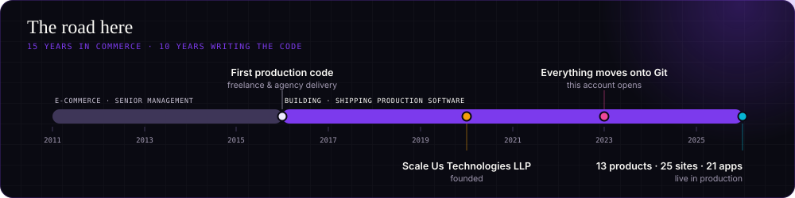
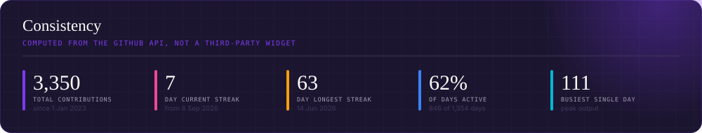
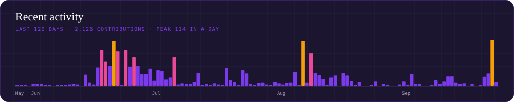

<div align="center">


<a href="https://scaleus.in"></a>
<a href="https://www.linkedin.com/in/jasminder-singh-chhabra/"></a>
<a href="https://scaleus.in/products"></a>
<a href="https://scaleus.in/portfolio"></a>


</div>

---

I run **[Scale Us Technologies LLP](https://scaleus.in)** out of India — and I'm the one shipping. Thirteen products in the suite, every one of them live and paying its own way: AI voice agents that answer phones, a WhatsApp Business platform on our own Meta Business Manager, social publishing across nine networks, restaurant ordering, HRMS and payroll, virtual tours, LMS, analytics, invoicing, QR, short-video and dating platforms.

Alongside that, I build for founders abroad — **thirteen products live across the UK, USA, UAE, Singapore, Saudi Arabia, Kenya and Australia**, in agri-tech traceability, legal AI, ESG reporting, clean energy and commodity trading.

And because "we'll make it interactive" means nothing on a slide, there's a **[Design Lab](#-design-lab--interaction-demonstrated)** of fourteen working demos — drivable 3D worlds, scroll-driven cinematography, WebGPU depth scanning — every one a real page you can scroll.

Fifteen years in e-commerce and senior management taught me what a business actually needs; I've spent the last ten building it myself, since 2016. These days I write code **with AI in the loop** — spec, generate, review, ship — which is how one founder keeps thirteen products moving at once.

The graph below starts in 2023, because that's when I moved the operation onto Git. The work started well before it.

Most of what I build is **private and commercial**, so the numbers below are the honest measure of the work, not the repo list.

```
Laravel + Blade monoliths  ·  Node/TypeScript services  ·  Flutter apps
Design system → thirteen products  ·  Git → production on every push
```




---

## 📊 The numbers

<div align="center">


</div>

> Every number on this page is **generated from the GitHub API by [a workflow in this repo](.github/workflows/refresh-cards.yml)**, refreshed every four hours — not by a third-party widget service.
> That's deliberate. The popular `github-readme-stats` and `github-profile-trophy` instances were returning `503`/`402` when this profile was built; none of them can read private repositories, which is where nearly all of this work lives; and the one hosted streak widget I did try was reporting a 54-day streak as 8 and a total ~700 short. Owning the query means the figures reconcile with GitHub's own graph, year for year.

<div align="center">





<picture>
  <source media="(prefers-color-scheme: dark)" srcset="https://raw.githubusercontent.com/Jasminder-Chhabra/Jasminder-Chhabra/output/snake-dark.svg">
  <source media="(prefers-color-scheme: light)" srcset="https://raw.githubusercontent.com/Jasminder-Chhabra/Jasminder-Chhabra/output/snake-light.svg">
  
</picture>

</div>

---

## 🚀 The Scale Us suite

Thirteen products, all live in production right now.

| Product | What it does | Live |
|---|---|---|
| **Scale AI Calling** | Human-sounding AI voice agents that call leads, qualify them, book appointments and answer the phone 24/7 | [aicall.scaleus.in](https://aicall.scaleus.in) |
| **Scale WhatsApp** | Full WhatsApp Business platform — team inbox, broadcasts, visual flows, AI chatbots, catalogue | [whatsapp.scaleus.in](https://whatsapp.scaleus.in) |
| **Scale Social** | Compose once, publish to nine networks. Visual calendar, AI content studio, unified inbox | [post.scaleus.in](https://post.scaleus.in) |
| **ScaleMail** | Newsletter + lifecycle automation — drag-and-drop builder, segmentation, A/B testing | [emails.scaleus.in](https://emails.scaleus.in) |
| **Scale Dining** | Restaurant platform — QR menus, contactless ordering, kitchen display, reservations | [scaledining.com](https://scaledining.com) |
| **ScaleTour** | Virtual tours — 360° panoramas, VR walkthroughs, interactive floor plans | [tour.scaleus.in](https://tour.scaleus.in) |
| **Scale LMS** | Learning platform with tutor marketplace, live sessions and self-paced courses | [lms.scaleus.in](https://lms.scaleus.in) |
| **Scale Analytics** | Privacy-first web + product analytics — real-time dashboards, heatmaps, session replay | [analytics.scaleus.in](https://analytics.scaleus.in) |
| **Scale Invoice** | Invoicing for freelancers and teams, with GST support and recurring billing | [invoice.scaleus.in](https://invoice.scaleus.in) |
| **Scale HR** | Full HRMS — attendance, leave ledger, payroll cycles, payslips, projects and CRM | [hr.scaleus.in](https://hr.scaleus.in) |
| **Scale QR** | QR generator + dynamic short links — scan analytics, password-protected and expiring codes | [qr.scaleus.in](https://qr.scaleus.in) |
| **Scale Shorts** | Short-video platform with creator tools, feeds and monetisation | [shorts.scaleus.in](https://shorts.scaleus.in) |
| **Scale Dating** | Dating platform — matching, chat, moderation and subscriptions | [dating.scaleus.in](https://dating.scaleus.in) |

<div align="center">
<a href="https://scaleus.in/products"></a>
</div>

---

## 📱 Shipped to the stores

Twenty-two store listings through review and out to real users — across [**Scale Us**](https://play.google.com/store/apps/developer?id=Scale+Us) and [**Jasminder Singh Chhabra**](https://play.google.com/store/apps/developer?id=Jasminder+Singh+Chhabra) on Google Play, plus iOS.

Every one is **Flutter, from a single codebase** — so each ships to both platforms; the links below are the listings live today.

**On-demand mobility** — the Uber/Ola pattern, both sides of the marketplace

| App | | |
|---|---|---|
| **Quick Driver** — customer app, live tracking & trip management | Flutter · iOS + Android | [App Store](https://apps.apple.com/in/app/quick-driver-in/id6758759788) · [Google Play](https://play.google.com/store/apps/details?id=com.quickdriver.scaleuscustomer) |
| **Quick Rider** — the driver-side app | Flutter · iOS + Android | [App Store](https://apps.apple.com/in/app/quick-driver-partner/id6758837751) · [Google Play](https://play.google.com/store/apps/details?id=com.quickdriver.scaleusdriver) |
| **Scale Driver** — verified driver booking, hourly or full-day | Flutter | [Google Play](https://play.google.com/store/apps/details?id=com.scaleus.scaledrivercustomer) |

**Multi-vendor commerce** — a full three-sided marketplace

| App | | |
|---|---|---|
| **Scale Local** — customer storefront | Flutter | [Google Play](https://play.google.com/store/apps/details?id=com.scaleus.scalelocal) |
| **Scale Local Rider** — delivery app | Flutter | [Google Play](https://play.google.com/store/apps/details?id=com.scaleus.scalelocal.rider) |
| **Scale Local Seller** — vendor/merchant app | Flutter | [Google Play](https://play.google.com/store/apps/details?id=com.scaleus.scalelocal.seller) |
| **Scale Shop Seller** — storefront management for merchants | Flutter | [Google Play](https://play.google.com/store/apps/details?id=com.scaleus.scaleshop.seller) |

**Games & rewards**

| App | | |
|---|---|---|
| **GameBox** — 50+ games, play-and-earn rewards | Flutter | [Google Play](https://play.google.com/store/apps/details?id=com.scaleus.gamevault) |
| **Zabla Super Deluxe** | Flutter | [Google Play](https://play.google.com/store/apps/details?id=com.zablasuperdelux.game) |
| **Word Puzzle** | Flutter | [Google Play](https://play.google.com/store/apps/details?id=scaleus.wordsearch) |
| **Neon Maze** | Flutter | [Google Play](https://play.google.com/store/apps/details?id=com.neonmaze.game) |
| **Stacks** | Flutter | [Google Play](https://play.google.com/store/apps/details?id=com.stacks.game) |

**Kids, learning & fitness**

| App | | |
|---|---|---|
| **Scale Little Learners** — early-years learning | Flutter | [Google Play](https://play.google.com/store/apps/details?id=com.scaleus.littlelearners) |
| **Preschool Fun Learn** | Flutter | [Google Play](https://play.google.com/store/apps/details?id=com.kidslearning.kidsplay.scaleus.preschool.funlearn) |
| **Rainbow Rush** — drawing & colour play | Flutter | [Google Play](https://play.google.com/store/apps/details?id=com.scaleus.kidsdrawing1) |
| **Actyv** — personal trainer & fitness | Flutter | [Google Play](https://play.google.com/store/apps/details?id=com.scaleus.actyv) |
| **Scale Nutrition** — diet plans and nutrition tracking | Flutter | [Google Play](https://play.google.com/store/apps/details?id=com.scaleus.scalenutrition) |

**Business & media**

| App | | |
|---|---|---|
| **Scale HRMS** — attendance, leave and payroll in your pocket | Flutter | [Google Play](https://play.google.com/store/apps/details?id=com.scaleus.scalehrms) |
| **Scale Shorts** — short-video creation and feeds | Flutter | [Google Play](https://play.google.com/store/apps/details?id=com.scaleus.scaleshorts) |
| **Scale Book** — booking and appointments | Flutter | [Google Play](https://play.google.com/store/apps/details?id=com.scaleus.scalebook) |

<div align="center">
<a href="https://play.google.com/store/apps/developer?id=Scale+Us"></a>
<a href="https://play.google.com/store/apps/developer?id=Jasminder+Singh+Chhabra"></a>
</div>

---

## 🌍 Built for founders abroad

Thirteen products live across **seven countries**, in domains where the hard part is the domain — not the framework.

| Product | What it does | Sector | Where |
|---|---|---|---|
| **[Materra](https://www.materra.tech)** | Climate-resilient cotton traceability, farm to fabric | AgriTech | 🇬🇧 UK |
| **[Qanooni](https://qanooni.ai)** | Legal AI for drafting and research, English + Arabic | Legal AI | 🇦🇪 UAE |
| **[Corpstage](https://corpstage.com)** | ESG and sustainability reporting for enterprises | ESG · Compliance | 🇸🇬 Singapore |
| **[Naqaa Solutions](https://www.naqaa.com.sa)** | Corporate sustainability and recycling dashboards | Sustainability | 🇸🇦 Saudi Arabia |
| **[PetroPal](https://petropal.africa)** | Wholesale petroleum trading with live pricing | Commodity Trading | 🇰🇪 Kenya |
| **Secure2Go** | IoT lone-worker safety platform | Safety · IoT | 🇦🇺 Australia |
| **[Bonding Health](https://bondinghealth.com)** | ADHD parenting guidance and tracking | HealthTech | 🇺🇸 USA |
| **[SportLync](https://sportlync.com)** | Social matching for golf, tennis and pickleball | Social | 🇺🇸 USA |
| **[WindEverest](https://www.windeverest.com)** | EV charging optimised against wind-energy surplus | Clean Energy | 🇺🇸 USA |
| **[Boardsi](https://boardsi.com)** | Executive board-placement matching | HR Tech | 🇺🇸 USA |
| **Xicomm** | Wholesale telecom carrier platform | Telecom | 🇺🇸 USA |
| **Sourceasy** | Apparel manufacturing marketplace | Supply Chain | 🇺🇸 USA |
| **[getBeauty.ai](https://www.getbeauty.ai)** | AI aesthetic-procedure simulation and booking | AI Health | 🌐 Global |

---

## 🌐 Client work on the web

Twenty-five live sites and counting — commerce, custom platforms and creative builds.

| | |
|---|---|
| **[texmopipe.com](https://texmopipe.com)** — industrial e-commerce, plus a full [**bidding portal**](https://bidding.texmopipe.com) | E-commerce · Custom |
| **[satnaamherbals.co.in](https://satnaamherbals.co.in)** — custom-built commerce platform | Custom e-commerce |
| **[sahejfashion.com](https://sahejfashion.com)** · **[anphar.com](https://anphar.com)** · **[vyasayurved.com](https://vyasayurved.com)** | E-commerce |
| **[khalsawale.com](https://khalsawale.com)** — industrial & medical supply | E-commerce |
| **[belloricco.com](https://belloricco.com)** — Shopify fashion storefront | E-commerce |
| **[livingwater.scaleus.in](https://livingwater.scaleus.in)** — lead-gen for pressure-washing services 🇨🇦 | Services |
| **[portfolio1.scaleus.in](https://portfolio1.scaleus.in)** — ten creative site builds in one showcase | Creative · WordPress |

---

## 🏗️ Concept builds & pitch prototypes

Full working prototypes I build to pitch an idea or scope a build — not client deliveries. Each one is live and clickable.

<div align="center">

| | | |
|---|---|---|
| **[BulkBazaar](https://bazaar.scaleus.in)**<br><sub>B2B wholesale marketplace with slab pricing</sub> | **[Clinic Saathi](https://clinic.scaleus.in)**<br><sub>WhatsApp AI agent for clinic appointments</sub> | **[APMC Mandi](https://apmc.scaleus.in)**<br><sub>Agri-mandi arrivals, auctions and e-payments</sub> |
| **[RentSetu](https://rentsetu.scaleus.in)**<br><sub>Property and equipment rental with verification</sub> | **[Yatra Setu](https://yatra.scaleus.in)**<br><sub>Tours and trips booking platform</sub> | **[Zippi](https://zippi.scaleus.in)**<br><sub>Super-app: shopping, food and mobility</sub> |
| **[HealthCube Labs](https://bloodtest.scaleus.in)**<br><sub>At-home diagnostics with phlebotomist dispatch</sub> | **[CampusBite](https://campusbite.scaleus.in)**<br><sub>College canteen pre-ordering with queue-skip</sub> | **[Sangam](https://investigations.scaleus.in)**<br><sub>Case management for investigation agencies</sub> |

</div>

---

## 🎨 Design Lab — interaction, demonstrated

Working concepts, not mockups. Every one is a real page you can scroll — built to show what a site *can* do before we build yours.

| Demo | What it does | Built with |
|---|---|---|
| **[Drivable 3D world](https://studio.scaleus.in/drive/)** | A world you steer through instead of scrolling — real-time physics, a controllable vehicle, project billboards you drive up to | Three.js · Physics |
| **[Scroll-driven 3D world](https://studio.scaleus.in/kage/)** | A live 3D scene the scroll walks you through — temple, lantern light, rain and drifting leaves, all in code, no video | Three.js · WebGL |
| **[Cinematic horizontal scroll](https://portfolio1.scaleus.in/)** | The page moves sideways chapter by chapter, with an optional soundtrack and progress counter | Horizontal scroll · Sound |
| **[Depth-map scanning](https://studio.scaleus.in/scan/effect1/)** | A scanning light sweeps a flat photograph and reveals its depth — a 2D photo that behaves like 3D | WebGPU · Depth map |
| **[Perspective grid scroll](https://studio.scaleus.in/grid/)** | Image grids tilt into perspective and reflow — the third axis is driven by scroll position | GSAP · Perspective |
| **[Layout choreography](https://studio.scaleus.in/layouts/)** | One set of images, many layouts. The grid re-forms as you scroll — the layout itself is the animation | Layout flip · GSAP |
| **[Liquid glass](https://portfolio1.scaleus.in/project2/)** | Frosted, refracting panels over live video that shift with the cursor — the iOS-26 glass language in a browser | Glassmorphism · Video |
| **[Object scroll](https://portfolio1.scaleus.in/demo2/)** | A product rotates, opens and reassembles as you scroll — the scrollbar drives an animation timeline | 3D object · Scroll timeline |
| **[Parallax depth](https://portfolio1.scaleus.in/demo4/)** | Foreground, subject and background move at different speeds, so a flat page reads as depth | Parallax · Lightweight |
| **[Colour-shift scroll](https://portfolio1.scaleus.in/demo5/)** | The background crossfades from one brand colour to the next as sections pass | Colour transitions |
| **[Snap sections](https://portfolio1.scaleus.in/demo9/)** | Full-height panels that snap into place, so the visitor always sees a finished composition | Scroll snap · Full-bleed |
| **[Creative layout](https://portfolio1.scaleus.in/demo10/)** | Editorial, off-grid layout with oversized type and asymmetric imagery — art-directed, not template-shaped | Editorial · Big type |
| **[Scroll techniques](https://portfolio1.scaleus.in/demo11/)** | A sampler putting pinning, reveals, sticky stacks and speed changes side by side | Motion sampler |
| **[Before & after](https://portfolio1.scaleus.in/demo14/)** | Drag-to-compare sliders — the pattern that sells restoration, renovation and dentistry | Comparison · Drag |

<div align="center">
<a href="https://scaleus.in/portfolio/design"></a>
</div>

---

## 🛠️ Stack

<div align="center">


<br>


</div>

---

## 🧰 Open source — the Scale Tools suite

Four toolkits of free utilities that run **entirely in your browser**. No sign-up, no watermarks, no upload limits, no credit caps — and your files never leave your device. There is no backend at all: turn off your Wi-Fi and they still work. One shared design system across all four, MIT-licensed, dependencies vendored so nothing phones home.

| Toolkit | What's inside | |
|---|---|---|
| **[Scale Tools](https://github.com/Jasminder-Chhabra/scale-tools)** | Merge & split PDFs, compress and convert images, JSON, word count, Base64, passwords, contrast | [Open](https://jasminder-chhabra.github.io/scale-tools/) |
| **[Scale Dev Tools](https://github.com/Jasminder-Chhabra/scale-dev-tools)** | JSON ⇄ YAML ⇄ CSV ⇄ XML, JWT decoder, SHA hashes, UUID, regex, diff, cron, colour, case | [Open](https://jasminder-chhabra.github.io/scale-dev-tools/) |
| **[Scale Image Tools](https://github.com/Jasminder-Chhabra/scale-image-tools)** | Resize with social presets, crop, rotate, watermark, favicon packs, palettes, images→PDF, EXIF stripping | [Open](https://jasminder-chhabra.github.io/scale-image-tools/) |
| **[Scale SEO Tools](https://github.com/Jasminder-Chhabra/scale-seo-tools)** | SERP preview by pixel width, Open Graph, Schema JSON-LD, QR codes, UTM builder, robots.txt, sitemap check, GST | [Open](https://jasminder-chhabra.github.io/scale-seo-tools/) |

<div align="center">
<a href="https://github.com/Jasminder-Chhabra/scale-tools"></a>
<a href="https://github.com/Jasminder-Chhabra/scale-dev-tools"></a>
<a href="https://github.com/Jasminder-Chhabra/scale-image-tools"></a>
<a href="https://github.com/Jasminder-Chhabra/scale-seo-tools"></a>
</div>

---

## ⚙️ What makes the work different

- **We own the pipes.** WhatsApp runs on our own Meta Business Manager, not rented through a BSP — so clients get direct pricing and aren't locked into a reseller's margins. Same principle everywhere: if it's core to the product, we own it.
- **Performance is a feature, not a phase.** PageSpeed 99+ on mobile *and* desktop, layout shift near zero. Fast sites convert; that's the whole argument.
- **One design system across thirteen products.** A single token set means the suite looks like one company instead of thirteen acquisitions — and a new product ships branded on day one.
- **AI-assisted, not AI-generated.** I spec it, the model drafts it, I review and own every line that ships. Ten years of judgement is what makes moving that fast safe.
- **Everything ships from Git.** Push and it's live in a minute. That discipline replaced years of edit-and-upload, and it's the single biggest reason one founder can hold twenty-five sites and twenty-two apps at once.

---

## 🤝 Work with me

I take on **custom software builds** and **white-label deployments** of the Scale Us suite.

<div align="center">

<a href="https://scaleus.in"></a>
<a href="https://www.linkedin.com/in/jasminder-singh-chhabra/"></a>
<a href="mailto:jasminder@scaleus.in"></a>

<br><br>


<sub>Built with the Scale Us design system. Stat cards regenerate weekly from the GitHub API.</sub>

</div>
